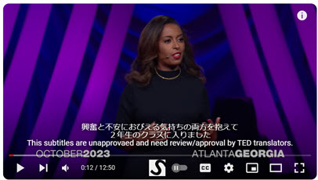
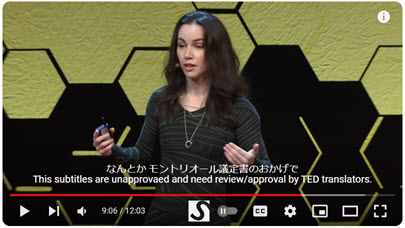
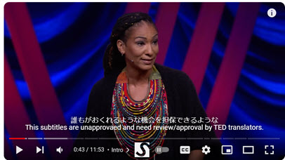

# Unofficial TED talk subtitles
TED talks come with official transcript for the spoken language and for translated languages. TED talk unofficial subtitles are not allowed to be distributed.

This repo is to provide <i><b>interim unofficial</b></i> subtitles that are yet to be reviewed but are looking for ways to share them to broader audience so that TED talks will be viewed prior to the official release of the translated subtitles. TED talk subtitles are strictly owned by TED organization and shouldn't be distributed without the written permission by TED as it is wrtieen as follows at [Terms and Conditions](https://www.ted.com/participate/translate/subtitling-resources/otp-terms-and-conditions).

<i>All transcripts and translations are covered by TED's Creative Commons 3.0 license. Translators are free to share their translations so long as they conform to the Creative Commons 3.0 terms: attribute the talk; noncommercial use only; and no derivative works. TED retains the copyright to all talks, transcripts and translations, in order to maintain the integrity of the presentation, and conform to our legal arrangement with speakers.</i>

View TED talks with the translated subtitles by using proprietary browser extensions that help you show uploaded subtitles from your PC. One of the examples could be this extension, which is quoted but not endorsed, [Substital](https://chromewebstore.google.com/detail/substital-add-subtitles-t/kkkbiiikppgjdiebcabomlbidfodipjg). Those extension can play a custom subtitle files in the SRT format. This repo retains unofficial unapproved subtitles.

With such tools, you can override the behavior of YouTube in your browser, and display subtitles uploaded to your browser by you. Again, I am not endorsing this tool, but screenshots below are of the tool called <b>Substial</b>.
If you are using such tools, adjust the playback start time to <i><b>-4 seconds</b></i> where TED Talks video channel has roughly equivalent 4 seconds of the introductory animated clip. 

<h2>The subtitles on this repo are listed below.</h2>

| title                                        |speaker| YouTube link                                           | TED site link                                                                                    | Subtitles in SRT                                                           |
|----------------------------------------------|-|--------------------------------------------------------|--------------------------------------------------------------------------------------------------|----------------------------------------------------------------------------|
|How to Build a Global Pro-Democracy Movement | Yordanos Eyoel | [YouTube](https://www.youtube.com/watch?v=qjGmzBp2fFk) | [TED.com](https://www.ted.com/talks/yordanos_eyoel_how_to_build_a_global_pro_democracy_movement)| [ja](./001/how_to_build_a_global_pro_democracy_movement_ja_UNAPPROVED.srt) |
|The Dark Side of Competition in AI           | Liv Boeree | [YouTube](https://www.youtube.com/watch?v=WX_vN1QYgmE)| [TED.com](https://www.ted.com/talks/liv_boeree_the_dark_side_of_competition_in_ai)| [ja](./001/the_dark_side_of_competition_in_ai_ja_UNAPPROVED.srt)           |
|Is Technology Our Savior — or Our Slayer? | Ruha Benjamin |[YouTube](https://www.youtube.com/watch?v=QO3nY_u6hos)| [TED.com](https://www.ted.com/talks/ruha_benjamin_is_technology_our_savior_or_our_slayer)| [ja](./001/is_technology_our_savior_or_our_slayer_ja_UNAPPROVED.srt)       |

